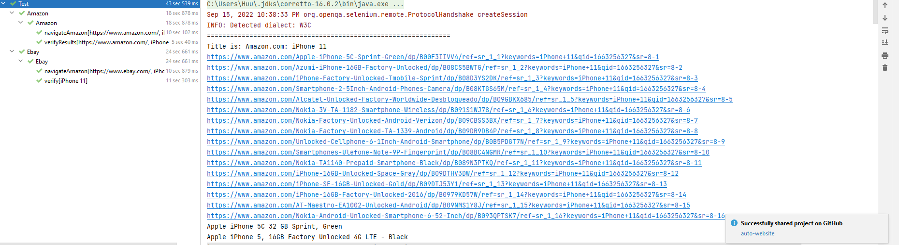

# auto-website
1. Setup run
    - install selenium-server-standalone https://selenium-release.storage.googleapis.com/index.html?path=3.5/
    - run command:
    # java -jar selenium-server-standalone.jar -port 4444 -role hub
2. Setup Chrome
    - install chrome driver https://chromedriver.chromium.org/downloads
   # java -Dwebdriver.chrome.driver="chromedriver.exe" -jar selenium-server-standalone.jar -role webdriver -hub http://localhost:4444/grid/register -port 5566
Result

